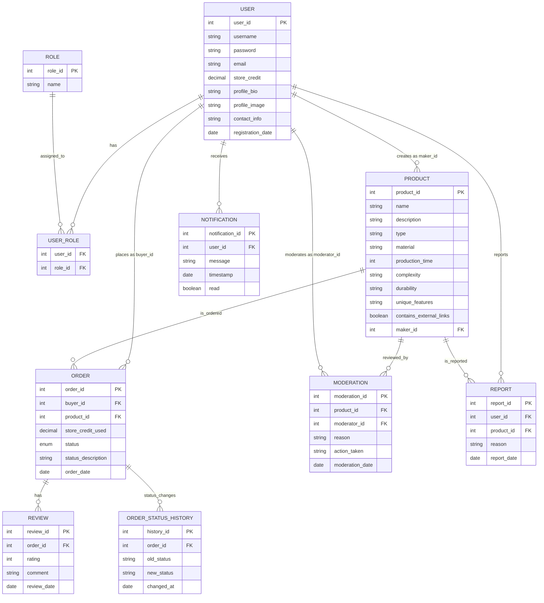

```mermaid
erDiagram
    USER {
        int user_id PK
        string username
        string password
        string email
        decimal store_credit
        string profile_bio
        string profile_image
        string contact_info
        date registration_date
    }

    ROLE {
        int role_id PK
        string name
    }

    USER_ROLE {
        int user_id FK
        int role_id FK
    }

    PRODUCT {
        int product_id PK
        string name
        string description
        string type
        string material
        int production_time
        string complexity
        string durability
        string unique_features
        boolean contains_external_links
        int maker_id FK
    }

    ORDER {
        int order_id PK
        int buyer_id FK
        int product_id FK
        decimal store_credit_used
        enum status
        string status_description
        date order_date
    }

    ORDER_STATUS_HISTORY {
        int history_id PK
        int order_id FK
        string old_status
        string new_status
        date changed_at
    }

    REVIEW {
        int review_id PK
        int order_id FK
        int rating
        string comment
        date review_date
    }

    NOTIFICATION {
        int notification_id PK
        int user_id FK
        string message
        date timestamp
        boolean read
    }

    MODERATION {
        int moderation_id PK
        int product_id FK
        int moderator_id FK
        string reason
        string action_taken
        date moderation_date
    }

    REPORT {
        int report_id PK
        int user_id FK
        int product_id FK
        string reason
        date report_date
    }

    USER ||--o{ USER_ROLE : "has"
    ROLE ||--o{ USER_ROLE : "assigned_to"
    USER ||--o{ PRODUCT : "creates as maker_id"
    USER ||--o{ ORDER : "places as buyer_id"
    PRODUCT ||--o{ ORDER : "is_ordered"
    ORDER ||--o{ REVIEW : "has"
    USER ||--o{ NOTIFICATION : "receives"
    ORDER ||--o{ ORDER_STATUS_HISTORY : "status_changes"
    PRODUCT ||--o{ MODERATION : "reviewed_by"
    USER ||--o{ MODERATION : "moderates as moderator_id"
    USER ||--o{ REPORT : "reports"
    PRODUCT ||--o{ REPORT : "is_reported"
```